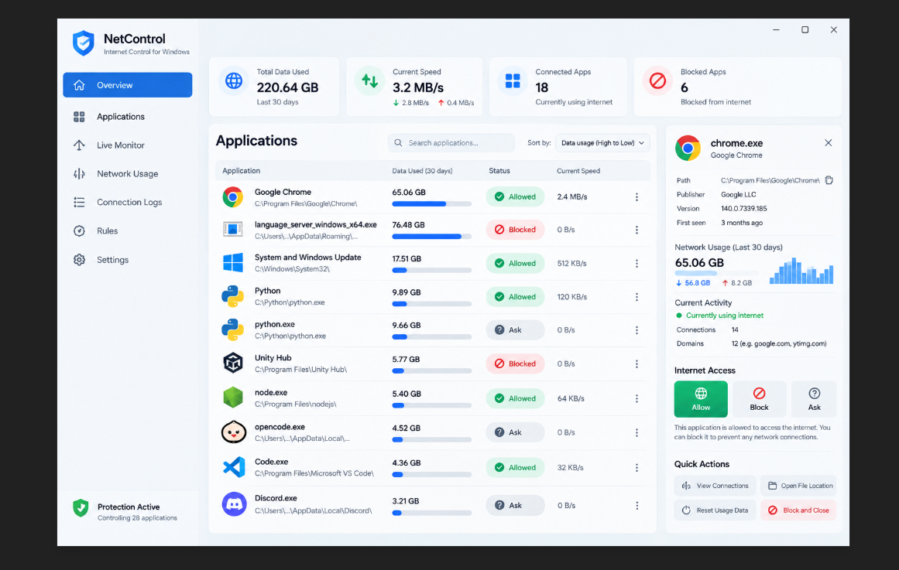

<div align="center">

# NetControl

### Native Windows firewall control — app-level Allow / Block / Ask from one desktop UI

**A real Windows utility in C++** — every Allow/Block writes a genuine Windows Defender
Firewall rule for that exact executable path, observed traffic comes from TCP EStats
(IPv4 + IPv6), and nothing is faked: Ask mode tells you it is monitor-only, and
bandwidth limits tell you they are pending the WFP callout.

**Built for** Windows power users · admins · developers who want per-app Internet
control — running **on machines they own and administer**.

<br/>

[](LICENSE.txt)
[](https://isocpp.org/)
[](https://www.microsoft.com/windows)
[](https://github.com/jojin1709/NetControl/stargazers)
[](https://github.com/jojin1709/NetControl/network/members)
[](https://github.com/jojin1709/NetControl/issues)
[](https://github.com/jojin1709/NetControl/commits/main)

<br/>


&nbsp;
&nbsp;
&nbsp;
&nbsp;
&nbsp;

<br/>

<a href="#build"></a>&nbsp;
<a href="docs/TEST_PLAN.md"></a>&nbsp;
<a href="docs/ARCHITECTURE.md"></a>&nbsp;
<a href="docs/WFP-CALLOUT.md"></a>

</div>

---

## Contents

- [Why NetControl](#why-netcontrol)
- [Screens](#screens)
- [Pages](#pages)
- [Build](#build)
- [Test the real blocking function](#test-the-real-blocking-function)
- [Honest scope](#honest-scope)
- [Documentation](#documentation)
- [Roadmap](#roadmap)
- [Contributing](#contributing)
- [License](#license)
- [Support](#support)

---

## Why NetControl

- **🛡 Real firewall enforcement** — Block creates an actual `NetControl Block - …`
  outbound rule in Windows Defender Firewall for that exact executable path; Allow
  reverts it. Nothing is simulated, and unrelated rules are never touched.
- **📊 Real network attribution** — per-PID byte counters from
  `GetPerTcpConnectionEStats` across **IPv4 and IPv6**, UDP endpoint counts, a live
  Mbps sparkline, 30-day daily history and per-application usage bars — all persisted
  locally under `%LOCALAPPDATA%\NetControl`.
- **⏰ Schedules that act** — add, edit, enable/disable and delete hourly block/allow
  windows per executable; the schedule is applied on the refresh tick and persisted
  to `schedules.tsv`.
- **🔎 Full transparency** — a Rules page listing every NetControl firewall rule with
  a per-row enable toggle and delete, plus CSV import/export and stale-rule cleanup.
- **🧰 One native window, seven pages** — no Electron, no runtime: Win32 + GDI double
  buffering, tray icon with balloons, light/dark themes, en/de/es localization,
  keyboard navigation, multi-select, and DPI-aware layout.
- **🤝 Honesty over hype** — Ask mode says it is monitor-only, bandwidth limits say
  enforcement is pending the WFP callout (`docs/WFP-CALLOUT.md`). Windows user-mode
  APIs cannot prompt per connection, and this project refuses to pretend otherwise.

<div align="center">

<br/>
<sub>UI design reference (<code>design/reference-ui.png</code>) the seven-page layout was built from — protection cards, searchable app list, and the detail panel with Allow / Block / Ask.</sub>
</div>

---

## Pages

| # | Page | What it does |
|:---:|---|---|
| 1 | 🏠 **Overview** | Protection cards, searchable/sortable app list, detail panel: Allow / Block / Ask, Open file, Connections, Set limit |
| 2 | 📦 **Applications** | The app list without cards — same controls, more room |
| 3 | 📈 **Live Monitor** | System throughput sparkline, total observed bytes, top apps by live speed |
| 4 | 💾 **Network Usage** | 30-day daily usage bars + per-application bars (mouse-wheel scrollable) |
| 5 | 📜 **Connection Logs** | Rolling log with CSV import/export and clear history |
| 6 | ⚙️ **Rules** | Firewall rules with per-row toggle/delete, scheduled access rules (add/edit/toggle/delete), bandwidth shaping set/clear |
| 7 | 🎛 **Settings** | Theme, auto-start, notifications, auto-refresh, network-profile gate, block-only-public, language (en/de/es), data clearing, About |

**Everywhere:** system tray with menu/tooltip/balloon · minimize-to-tray ·
right-click context menu · Ctrl+click multi-select · Ctrl+A / Ctrl+C / arrows / Enter /
Esc / F1 keyboard shortcuts · rule, log, schedule and limit changes persist immediately.

---

## Build

Requires **Windows 10/11 x64**, **Visual Studio** (or Build Tools) with *Desktop
development with C++*, a **Windows SDK**, **CMake 3.24+**, and **administrator rights**
when running (firewall administration).

```powershell
# 1 — configure (use "Visual Studio 17 2022" on VS 2022, "Visual Studio 18 2026" on VS 2026)
cmake -S . -B build -G "Visual Studio 17 2022" -A x64

# 2 — build Release
cmake --build build --config Release

# 3 — run the test suite
ctest --test-dir build -C Release --output-on-failure
```

```text
build\Release\NetControl.exe        ← the app (run as administrator)
build\Release\NetControlTests.exe   ← core logic tests
```

<details>
<summary>Generator reference</summary>

| Environment | Generator |
|---|---|
| Visual Studio 2022 | `-G "Visual Studio 17 2022" -A x64` |
| VS 2026 Build Tools | `-G "Visual Studio 18 2026" -A x64` |

CI (`.github/workflows/windows-build.yml`) builds on `windows-latest` and runs `ctest`.
See [BUILD_STATUS.md](BUILD_STATUS.md).
</details>

---

## Test the real blocking function

1. Start NetControl **as administrator**.
2. Select a harmless test executable.
3. Click **Block** → verify the app loses outbound connectivity and a
   `NetControl Block - …` rule appears in `wf.msc`.
4. Click **Allow** → verify connectivity returns.
5. Reboot → verify a persisted Block policy is recreated.

> Do not block critical Windows components unless you understand the consequences.

Full matrix (rules, schedules, bandwidth, logs, DPI, keyboard):
**[docs/TEST_PLAN.md](docs/TEST_PLAN.md)**.

---

## Honest scope

| Feature | What it really does |
|---|---|
| **Allow / Block** | Real `INetFwPolicy2` outbound rules for the exact exe path |
| **Ask** | Monitoring state only — Windows Firewall offers no per-connection prompt callback; a true prompt needs a WFP callout/driver |
| **Traffic data** | Per-PID IPv4 + IPv6 TCP bytes via EStats; UDP counted as endpoints (no per-process UDP byte API in user mode) |
| **Bandwidth limits** | Stored, shown and persisted; **not enforced** until the WFP callout module exists — the UI says so |
| **Publisher** | Reported as verified only when the Authenticode signature actually verifies |

These limitations are surfaced in the UI and docs rather than simulated away.

---

## Documentation

| Document | What's in it |
|---|---|
| [Architecture](docs/ARCHITECTURE.md) | module map: UI, ProcessManager, FirewallManager, NetworkMonitor, Schedule/Bandwidth/Logs |
| [Test plan](docs/TEST_PLAN.md) | full manual verification matrix |
| [Tests](docs/TESTS.md) | what the automated suite covers |
| [WFP callout design](docs/WFP-CALLOUT.md) | the path to real Ask mode and bandwidth enforcement |
| [Roadmap](docs/ROADMAP.md) | phases 1–3, current state |
| [Security](docs/SECURITY.md) | disclosure policy |
| [Build status](BUILD_STATUS.md) | toolchain and CI notes |

---

## Roadmap

- **Phase 1 (done)** — native 7-page UI, real firewall rules, IPv4+IPv6 EStats,
  schedules, logs, bandwidth registry, tray, themes, i18n, tests.
- **Phase 2** — richer connection/domain presentation, upload/download attribution,
  service grouping, real UDP bytes.
- **Phase 3** — signed WFP callout driver + service for enforceable bandwidth limits
  and true interactive Ask mode. Not approximated with fake UI.

---

## Contributing

**Fork it → find a bug → fix it in your fork → open a PR.** We review and merge.

> **Read [LICENSE.txt](LICENSE.txt) first.** NetControl is **GPL-3.0**: you may fork,
> build, run, modify and share it — but every copy and derivative must stay GPL-3.0
> with its source, so this code can never be absorbed into a proprietary or
> closed-source product. Fixes come back here as pull requests.

Before opening a PR:

1. `cmake --build build --config Release` — zero errors.
2. `ctest --test-dir build -C Release --output-on-failure` — all green.
3. Keep the honest-scope rules: never simulate a capability Windows user-mode APIs
   cannot provide.

Templates: [bug report](.github/ISSUE_TEMPLATE/bug_report.md) ·
[feature request](.github/ISSUE_TEMPLATE/feature_request.md) ·
[PR checklist](.github/PULL_REQUEST_TEMPLATE.md). Full guide:
**[CONTRIBUTING.md](CONTRIBUTING.md)**.

---

## License

**GPL-3.0** — full text in [LICENSE.txt](LICENSE.txt).

| You can | You cannot |
|---|---|
| Fork, build, run and study it | Ship a closed-source product containing this code |
| Modify your own fork | Distribute a derivative without the same GPL-3.0 license and source code |
| Send pull requests back to this repo | Remove or replace the license, or claim ownership |
| Share copies — they stay GPL-3.0 | Present a fork as the official project |

Every copy and derivative must stay GPL-3.0 — the code can never be absorbed into a
proprietary project.

---

## Support

Free and open-source. If it saves you time, ⭐ **star the repo** — it helps others
discover the project.

<div align="center">

### ❤️ Sponsor jojin1709

<a href="https://github.com/sponsors/jojin1709"></a>&nbsp;
<a href="https://github.com/sponsors/jojin1709"></a>

Sponsorship keeps NetControl maintained: firewall-rule correctness across Windows
updates, IPv4/IPv6 observation fixes, docs, and the road to real WFP enforcement.

<br/>

<a href="https://github.com/jojin1709/NetControl/stargazers"></a>

**Developed by JOJIN JOHN**

</div>

> **Manage admin firewall rules only on systems you own or are authorised to administer.**
